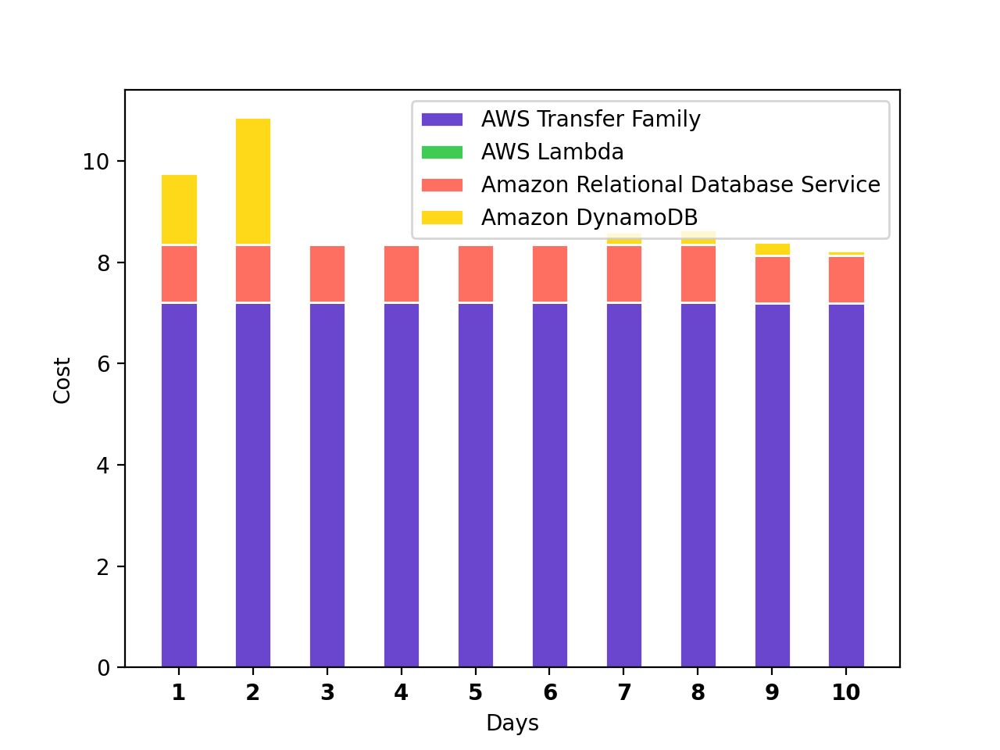

# Cost Reporter

 

A lambda which sends a daily cost and trend report to slack. It helps with one of the three [**FinOps**](https://www.linkedin.com/company/finops-foundation/) phases: `Inform`. It can send you a report **every day** / **only when cost increases** / **only when cost breached a threshold** depending on your [configuration](template.yaml).

Helpful to keep an eye in new projects when the architecture changes quickly, but also for existing projects if you want to keep a close eye on cost.

Example:



## Configuration

The following settings can be configured:
- `Title`: The title for the cost report (i.e.: "Project: XYZ")
- `Days`: The days to report (i.e. 10)
- `MinDailyCost`: The minimal daily cost required to trigger a report in $ (i.e. 10)
- `OnlyNotifyOnIncrease`: Whether to send a report only when the cost increased from yesterday to today
- `TargetChannel`: The target channel (i.e. "#costoptimization")

## Deployment

Prerequisites:
- [AWS SAM CLI](https://docs.aws.amazon.com/serverless-application-model/latest/developerguide/serverless-sam-cli-install.html)
- A slack token for the lambda (`xoxx-....`) with the permission to write files and send messages
- A `SecureString` SSM Parameter for the Slack token: `/cost-reporter/slack-token`

How to deploy:

```bash
sam build --use-container
sam deploy --guided
```
